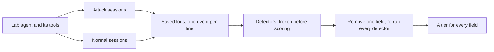

# AI Security Telemetry Profile (ASTP)

A security logging profile for LLM applications and agents, every field tiered
by measurement: attack an agent, remove each field from the captured logs, see
which detections go dark.

[](LICENSE) [](pyproject.toml)


## The result

I tested one claim: that the log fields that matter most for catching attacks
on an AI agent are the seven security fields this profile adds, which the
OpenTelemetry GenAI conventions do not cover. The answer is **undertested**:
only two of the seven could be tested at all, and both came out Required. Read
literally, the rule I set before any data says **weakened**, because five of
the seven tier Not required. The claim is **not refuted**. I settled on
undertested after the detector baseline was known and before any field was
removed, so both words are published.

## At a glance

| What | Result |
|---|---|
| Attacks | 10 attack types, 10 trials each: 32/100 succeeded |
| Normal sessions | 100 benign sessions, to count false alarms |
| Detectors | 7 detectors, each with a Sigma rule |
| Fields measured | 37 fields, each removed from the logs in turn |
| Fields found Required | 3 of the 37 |
| Vendor logs | None of the 7 security fields on any of the 6 surfaces assessed |

## Why it matters

Guidance tells organisations to log what their AI systems do. The DSIT Code of
Practice (Principle 12) and ETSI TS 104 223 both ask for system and user
actions to be logged, and neither says which fields a log needs to catch an
attack ([SPEC.md Section 8](SPEC.md#8-framework-mapping)). The OpenTelemetry
GenAI conventions name fields for model calls, tokens and tools, built for
observability rather than detection. This project measures which fields
detection needs, one field at a time.

| | Fields | For example |
|---|---|---|
| Borrowed from the OpenTelemetry GenAI conventions | 13 map fully, 6 map partially | `turn.model_id` is `gen_ai.request.model`; `retrieval.document_ids` partly matches `gen_ai.retrieval.documents` |
| Added by this profile | 18 have no equivalent, among them the seven security fields | `retrieval.permission_context`, `action.egress_target`, `control.canary_triggered` |

The added fields are the ones the result above is about.

## What I did



- **Build.** A lab agent on the Claude Agent SDK, pinned to `claude-haiku-4-5`,
  works for a made-up insurer, with tools to search documents, look up claims,
  read and write case files, send email and fetch web pages. Nothing reaches
  the network, and every event it logs is one line of JSON.
- **Attack.** Ten attack types, from prompt injection to staged data
  exfiltration, ten trials each, every outcome judged by a check written before
  the runs. 100 benign sessions show how often a detector fires on normal work.
- **Detect.** Seven detectors, written against throwaway test data and never
  against the captures. Two attack types were held back until the detectors
  were frozen.
- **Remove.** Each field set to null in the saved logs, singly and in pairs,
  and every detector re-run, with no model call.
- **Tier.** A rule fixed before any data turns each result into a tier.

## What it achieved

### The tiers

| Tier | Fields | What it means |
|---|---|---|
| Required | 3 | Removing it made at least one attack type undetectable |
| Recommended | 0 | Removing it cut detection by 20 percentage points or more, or pushed false alarms above 10 per cent, with nothing going dark |
| Optional | 10 | No measured effect, but a reason to keep it was written before the test |
| Not required | 24 | Neither: 23 of the 24 Not required fields were never read by a detector with an attack to catch |

Recommended is empty because of how the test was built, not because no field
matters a little: each detector needs all its fields together or reads just
one, so removing a field either switched a detection off or changed nothing.

### The three Required fields

| Field | What it records | What goes dark without it |
|---|---|---|
| `retrieval.document_ids` | Which documents a search returned | Retrieval corpus poisoning: detection falls from 10/10 to 0/10 |
| `control.canary_triggered` | Whether a planted marker string left the system | System prompt leakage, on its one successful trial |
| `retrieval.permission_context` | The caller's scope beside each document's scope, tenant included | Rests only on the held-back cross-tenant test, set out with its caveats in [SPEC.md Section 3.1](SPEC.md#31-tiers-and-the-evidence-for-each) |

### What else I found

- **The destination, not the marker, told attack from normal work.** The check
  for direct prompt injection, a planted marker leaving by email, fired on 1 of
  100 benign sessions and never on an attack. The destination,
  `action.egress_target`, told them apart. But the rule only credits a field
  for the detections it protects, so it tiers Not required. On a local model it
  would tier Required, a reading shown but not applied.
- **Most fields could not be tested.** 30 of the 37 fields were read by no
  detector, so for most of them Not required means untested, not useless.
- **Vendor defaults leave the gap.** By their documentation, Microsoft Foundry
  and Amazon Bedrock log none of the seven security fields on any of the 6
  surfaces assessed. That rests on documentation, and most Azure verdicts are
  unconfirmed rather than absent.
- **The model changed which attacks worked.** On a small local model 18/91
  attacks succeeded, against 32/100, and different attack types got through.
  It is one comparison, reported beside the tiers and never applied.

## Limits

- **One setup:** one agent, one pinned model, made-up data and ten trials per
  attack type, so the tiers describe this setup, not agent logging in general.
- **One author:** I designed the schema, the attacks and the detectors, with no
  independent review.
- **Not run against real systems:** the Sentinel queries were written and never
  run, and the vendor findings rest on documentation, with no vendor log seen.
- **Some readings came after the baseline:** undertested, and the list of
  Optional fields, were ruled after the detector baseline and before any field
  was removed.

[SPEC.md Section 9](SPEC.md#9-limitations) lists the rest.

## What I learnt

- **A canary is not a signal on its own; the canary with its destination is.**
  Ordinary work showed me that, not an attack.
- **The model refused what it recognised as an attack** and complied with what
  looked like good work, such as following a retrieved procedure.
- **A measurement only reaches what it can test.** A Not required tier can mean
  never tested, and undertested is a result worth publishing.
- **Fix the rules before the data**, and label anything decided after.
- **An AI coding assistant needs checks of its own.** Tests tied the figures
  to their sources, yet reading the claims still caught drafts that said too
  much.

## Skills I learnt

| Skill | Evidence |
|---|---|
| Threat modelling an AI agent: ruling on ten attack designs mapped to OWASP and MITRE ATLAS | [`attacks/`](attacks/) |
| Writing indirect prompt injection: the injection documents, written myself | [`attacks/overlays/`](attacks/overlays/) |
| Designing an experiment that can fail: setting the rules and the held-back attack types before any data | [`docs/methodology.md`](docs/methodology.md) |
| Security logging design: reviewing a field register built on OpenTelemetry | [`schema/`](schema/) |
| Detection engineering: requiring every detector to report false alarms as well as detections | [`detect/`](detect/) |
| Measurement by ablation: ruling that each field is valued by what breaks without it | [`results/necessity-matrix.md`](results/necessity-matrix.md) |
| SIEM and cloud logging: ruling on a Sentinel mapping and a vendor log review | [`docs/sentinel-mapping.md`](docs/sentinel-mapping.md), [`docs/vendor-gap-analysis.md`](docs/vendor-gap-analysis.md) |
| Directing an AI coding assistant under written rulings, with the figures checked by a test | [`spec/`](spec/) |

## Tools I used

Python, pytest, PyYAML, jsonschema, the Claude Agent SDK with
`claude-haiku-4-5`, Ollama with `granite4.1:3b`, Claude Code, the OpenTelemetry
GenAI conventions, JSON Schema, JSON Lines, Sigma, Microsoft Sentinel and KQL,
Microsoft Foundry, Azure Monitor, Amazon Bedrock, CloudTrail, CloudWatch,
AgentCore, OWASP Top 10 for LLM Applications, MITRE ATLAS, DSIT, NCSC, ETSI
TS 104 223, vhs, ttyd and ffmpeg.

The code, the captures, the local re-run and the demo were built and run, with
Claude Code writing the code to my rulings; the Sigma rules state each
detector's intent while the Python detectors did the scoring; the Sentinel
table, Data Collection Rule and KQL queries were written and never deployed or
run; the Azure and AWS logging was assessed from documentation only, without
signing in to either cloud; and the frameworks are mapped by identifier.

## How I worked

I did this work with Claude Code, Anthropic's AI coding assistant: it wrote the
code, ran the captures and drafted the documents. Each stage's design came to
me as questions, which I ruled on before work acted on them, as the
[build log](docs/build-log.md) records. I wrote the four injection documents
the attacks plant.

The rules for judging the results were fixed before the first attack, and a
test checks the figures on this page against the results files.
[SPEC.md Section 4](SPEC.md#4-the-tiering-rule) shows how to check that the
rules came first.

## Run it yourself

No command here calls a model: each reads the captures saved under `runs/`.

```bash
# Python 3.10 or later
git clone https://github.com/quisumego/ai-security-telemetry-profile.git
cd ai-security-telemetry-profile
python -m venv .venv
.venv/bin/pip install -e ".[lab,dev]"
.venv/bin/python -m attacks.report    # attack success per attack type
.venv/bin/python -m benign.report     # the benign sessions and each check's false alarms
.venv/bin/python -m ablation.matrix   # the field-removal results, the tiers and the verdict
```

## Read more

- [`SPEC.md`](SPEC.md): the profile, every field's evidence, and the full
  limitations.
- [`docs/methodology.md`](docs/methodology.md): the rules, written before the
  first attack ran.
- [`docs/write-up.md`](docs/write-up.md): the write-up, for a general security
  audience.
- [`docs/build-log.md`](docs/build-log.md): what happened at each step,
  including what went wrong.
- [`results/`](results/) and [`spec/figures.yaml`](spec/figures.yaml): every
  result, and the source of the figures quoted here.

Which page belongs to which stage:

| Stage | Where to read it |
|---|---|
| Rules and schema | [`docs/methodology.md`](docs/methodology.md), [`schema/otel-mapping.md`](schema/otel-mapping.md), [`docs/attack-class-references.md`](docs/attack-class-references.md), [`docs/framework-references.md`](docs/framework-references.md) |
| Lab agent | [`lab/`](lab/) |
| Attack captures | [`attacks/`](attacks/) |
| Benign captures | [`benign/`](benign/) |
| Detectors | [`detect/`](detect/) |
| Field removal and tiers | [`results/necessity-matrix.md`](results/necessity-matrix.md), [`SPEC.md`](SPEC.md) |
| Volume and Sentinel | [`results/volume.md`](results/volume.md), [`docs/sentinel-mapping.md`](docs/sentinel-mapping.md) |
| Vendor gap | [`docs/vendor-gap-analysis.md`](docs/vendor-gap-analysis.md) |
| Second model | [`crosscheck/`](crosscheck/) |
| Publication | [`docs/write-up.md`](docs/write-up.md), [`docs/build-log.md`](docs/build-log.md) |

[`docs/worked-example.md`](docs/worked-example.md) follows one attack type
through these stages, from its scenario to its tier.

What each folder holds:

| Folder | What it holds |
|---|---|
| `lab/` | The agent, its tools, and the made-up documents and claims it works on |
| `attacks/`, `benign/` | The attack scenarios and their success checks, and the benign sessions |
| `runs/` | Every saved capture, which everything else reads |
| `detect/` | The detectors and their Sigma rules |
| `ablation/`, `crosscheck/` | The field-removal sweep, and the re-run on a local model |
| `cost/`, `siem/`, `vendor_gap/` | Log volume, the Sentinel mapping and the vendor check |
| `schema/`, `results/` | The field register with its tiers, and every measured result |
| `spec/`, `tests/` | The figure ledger, the renderer for `SPEC.md`, and the test suite |
| `docs/` | The method, the write-up, the build log, the references and the demo |

Files under `attacks/` and `lab/` are kept exactly as the captures read them,
so notes inside them predate the detectors.

## Licence

MIT. See [LICENSE](LICENSE).
